# 1.3 JFRの歴史 - JRockitからOpenJDKまで

## Project HotRockit - JRockitからHotSoptへ

JDK Flight RecorderはOpenJDK11から取り込まれてフリーになりましたが、JFR自体はかなり昔からあるプロダクトとなり微妙に名前を変えながら続いています。

JFRは元々は**JRockit Flight Recorder**としてBEAシステムズ社により開発されていたJRockitと呼ばれるSunに由来するHotSopt JVMとは別系統のJVMに組み込まれた機能でした。

BEAシステムズ社は元々WebLogicを開発した会社でありWebLogicを動かすのに最適なJVMを必要として独自のJVM開発を行なっていました。IBMや日立に富士通などJavaEEプロダクトを持っている会社は同様のアプローチを取っており、これは特に珍しいことではありません。

BEAシステムズ社は2008年にOracleに買収されWebLogicやJRockitはOracleの中核製品の一つになります。そして、2010年にSun MicrosystemsもOracleに買収されたことで、Oracleは2系統のJVMを持つ事になりました。

HotSopt JVMはJavaの開発元であるSunが開発を行なっており、当時OpenJDKも登場していたため利用例も多く最も人気のJVMでした。しかし、JRockitは以下のような特徴を持ちエンタープライズで非常に評判の良いものでした。

- パフォーマンス(JIT最適化/PermGenを持たないメモリ構造)
- 高速なGC(Deterministic GC)
- JRCMDやJMCのような使いやすいツール群
- JFRによる分析

こういったJRockitの評判の良い要素をHotSpotに取り込んで行こうというのがProject HotRockitです。

**図: Project HotRockit**

これらのJRockit由来の機能は徐々に取り込まれておりJDK8でPermGenを廃してMetaspaceに切り替えたのもその一環です。
特に、JFRを含むツール群はJDK7u40とかなり早い時期から取り込まれWebLogic等と組み合わせて運用する事が出来ました。

## OpenJDKと商用ライセンス

JDK7u40から取り込まれたJFRですがOracleのコマーシャルライセンスのみで使用可能な機能であったためOracle Java SE Advanced、またはWeblogicやCoherenceといったOracleの製品群と組み合わせることで利用できる機能でした。

そのため、OpenJDKにも取り込まれておらずOracle JDKのみで使用可能な機能でした。Oracle JDKでもデフォルトでは無効にされており`-XX:+UnlockCommercialFeatures`をJVMオプションで指定することで利用可能となるものでした。

一応、開発者のPCでは無償利用可能で、評価目的であれば開発環境およびテスト環境での利用は可能でしたが本番環境に適用できないという制約は大きく実質的にWeblogic利用者向けの機能になっていました。そのため「多くの現場で活用されている！」というよりは「Weblogic関係者の秘伝」的な位置付けになってしまっており、これはJRockit由来のAPIを非公式APIとして継続して利用していたことも影響していると思います。

ただし、性能は非常に安定しており筆者はJDK7u40から本番環境で適用していますが、JFR由来の性能劣化や不具合は経験したことが無くとても信頼の置けるツールです。

## JDK9でのAPIの刷新。そしてオープンへ

状況はJDK9から大きく動き始めます。

JEP 328にてJRockit由来の物をそのまま使っていたAPI群が刷新されJDK JFR APIとして整備され直しました。これに合わせて公式APIとしてサポートされる形になったのでカスタムイベントなどの作り方を含めて情報が公開されるようになりました。

これに伴ってほぼMission Controlと不可分で語られていたJFRは独立した仕組みとして運用する事ができるようになりました。実際にVisualVMがJFRをサポートする、という事例も出てきています。

さらにJDK11よりOracke JDKのみの商用機能であったJFRがオープンソースであるOpenJDKに取り込まれる事で商用ライセンスの有無にかかわらず本番で利用する事ができるようになりました。APIのオープン化と利用ライセンス自体のオープン化が果たされたことで、今JFRは非常に活用しやすい状態になっています。

JFRの変遷をまとめると以下のようになります。

**図: JFRの歴史**

また、2020年春にリリース予定のJDK14には**JFR Event Streaming(JEP349)**が取り込まれる予定です。これはJFRのログをモニタリング等に活用しやすくするもので、既存のエコシステムとの連携がますますしやすくなります。
