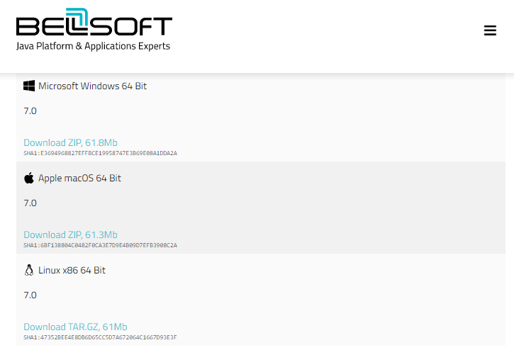
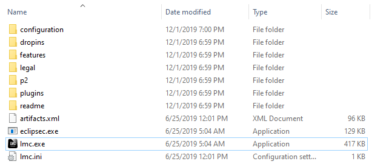
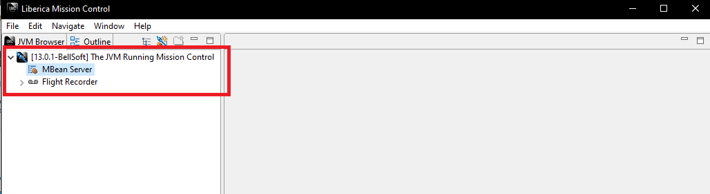
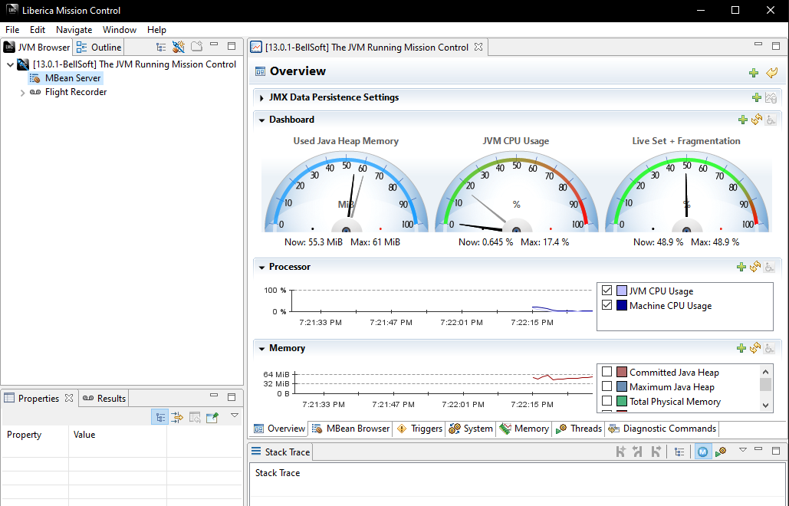
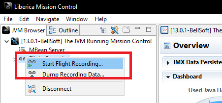
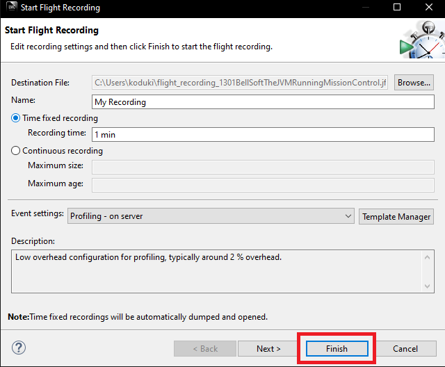
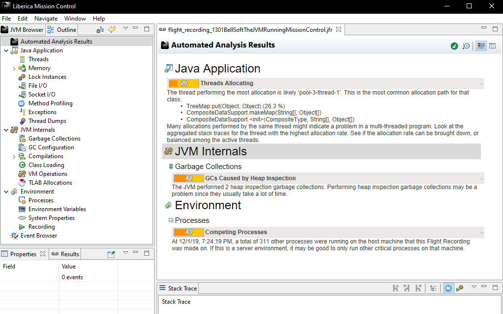

# 1.4 JFRの動作環境とJMCのインストール

## JFRの動作環境

JFRはJDK11以降であればOpenJDKの標準機能なので以下の環境であれば問題無くJFRが動作します。

| JDK       | サポートバージョン        |
| --        | --                      |
| Oracle JDK| from 7u40..8, 9-10, 11~ |
| Oracle OpenJDK| 11~    　　　　　　　|
| GraalVM| 19.2~                      |
| Red Hat OpenJDK| 11~                |
| Azul Zulu  | 8, 11~ 　　　　　　　　 |
| SapMachine  |  11~                  |
| Liberica JDK  | 11~                 |
| AdoptOpenJDK  | 11~                 |
| Amazon Corretto  | 11~              |

Azul ZuluはJFRが8にもバックポートされてるようなので、OpenJDKベースでJFRを8でどうしても使いたい時には試してみるのも良いかもしれないです。

1点だけ注意なのはOracle JDKを利用する場合です。Oracle JDKではJDK11より前からJFRが利用できますが商用機能です。また、7および8のAPIは9以降の現在のAPIと互換性がありません。

ライセンスに従って利用している限りはあまり問題は出ないと思いますが、もし古いOracle JDKを継続的に使用している場合はAPI等が違う部分があるので注意してください。

また、JFRはJava言語ではなくHotSpot VMの機能です。そのため、例えばAndroidでは利用できません。IBMのOpenJ9に関しては未確認ですが利用できないと思われます。

## JMCのインストール

ではJDK Mission Control(JMC)をインストールしましょう。以前はOracle JDKに同梱されていたのですが、現在はOpenJDKと同じくOSSとして別製品として切り出すことで誰でも利用できるようになっています。

公式サイトは下記になります。

https://openjdk.java.net/projects/jmc/7/

開発はこちら。

https://github.com/openjdk/jmc

ただし、いろいろな内部プロセスの問題から正式リリースが遅延しています。品質面では特に問題は出てないようなので各ディスビュータがビルドしたバイナリを利用するのが簡単です。

| Name       | URL        |
| --        | --                      |
| RH JMC    | https://developers.redhat.com/blog/2019/03/15/jdk-mission-control-red-hat-build-openjdk/ |
| Zulu Mission Control|https://www.azul.com/products/zulu-mission-control/|
| Liberica Mission Control |https://bell-sw.com/pages/lmc/|
| JDK Mission Contro | https://adoptopenjdk.net/jmc.html |

ベンダー固有名詞がついていますが原則すべて同一のものです。そのため、RH JMCを使ってAmazon CorretのJFRを使うとか、Liberica Mission Controlを使てOracle JDK 8のJFRを読むとかしても問題はありませんし普通に動作します。

2019/12/01現在の最新安定板は7です。8が絶賛開発中なので開発版のビルドが欲しい場合はAdoptOpenJDKのものを利用すると良いでしょう。

とりあえず今回は安定版にしたいのでLiberica Mission Controlを入れてみます。対象のプラットフォームを選んでダウンロードします。今回はWindowsです。



ダウンロードしたファイルを解凍すると以下のようなファイルが展開されます。その中のlmcを実行してください。([^1])



起動すると以下のような画面になります。左側に現在起動しているJVMのプロセスが並ぶのですが今は他に何も起動してないので自分自身のみが載っています。



JMCではJFRだけではなく、JMXでリアルタイムの値を取得する事も可能です。`MBeanServer`をダブルクリックすると以下のようにMBeanから取得した値が表示されます。




つづいて、JFRの取得と表示を行いましょう。
実運用ではJMCからJFRを取得する事は無いと思いますが、デモとか開発時に便利です。

`FlitRecorder`と書かれたメニューを右クリックして`Start Flight Recording`を選択します。



すると以下のようなダイアログが出ます。



今回は特に何も変更しないのでそのまま`Finish`を押しましょう。

しばらくJFRの取得のため待ちとなります。先ほど取得期間を1分に指定したので、待ち時間は1分です。
1分たつと以下のような画面が表示されます。



このトップ画面は自動診断です。GCなど怪しい部部分があればピックアップして表示されます。

左のメニューから調べたい情報を選択してドリルダウン形式で分析していくことが出来ます。

JMCを使った具体的な分析方法は5章で解説します。

[^1]: ビルドベンダー依存です。素のモジュールだとjmcになります。


## (オマケ)JMCのビルド

各種ディストリビューションのJMCを利用すれば問題はありませんが、自前でビルドを行いたい場合はdocker-composeを利用すると簡単です。

GitHubからソースコードをcloneして以下のコマンドを実行します。

```bash
docker-compose -f docker/docker-compose.yml run jmc
```

すると`target`ディレクトリにバイナリが出力されます。Dockerを使ったビルドの良い例だと思うので時間があれば中身を見てみるのも良いと思います。