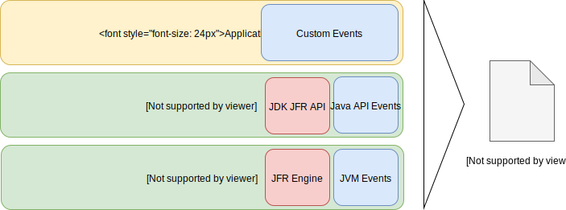

# 2.1 JFRのアーキテクチャ概要

## JFRにおける「イベント」

JFRはプロファイリング/診断のために**イベント**を集めるメカニズムです。

イベントとはJVMまたはJava アプリケーションから取得するデータで、「名前」「タイムスタンプ」「カスタムペイロード」を持ちます。こちらのペイロードが実際の性能情報等が書き込まれる部分で、CPUの情報とかヒープだとかスレッドだとか具体的な値が格納されています。



主として下記のような情報が取得できます。

| 取得対象 | 主な取得内容|
| -- | -- |
| オペレーティングシステム | メモリ、CPU Load、CPU情報、ネイティブライブラリ、プロセス情報 |
| JVM| メモリの割当て、クラスのロード, JIT, GC, メソッドプロファイルイベント|
| Java API | ソケット I/O, ファイル I/O, 例外、スレッド、モジュール情報|
| カスタムイベント | アプリケーションコンテナなどのミドルウェア、その他ユーザ定義イベント|

アプリケーション、JVM、OSと広範囲に情報が記録される事がわかるかと思います。また、カスタムに関しては下記のように作成/利用が可能です。

```java
public class HelloJFR {
    @Label("Hello World!")
    static class HelloWorldEvent extends Event {
        @Label("Message")
        String message;
    }
    public static void main(String[] args) {
        HelloWorldEvent event = new HelloWorldEvent();
        event.message = "Hello World!";
        event.commit();
    }
}
```

Weblogicのようにすでにカスタムイベントに対応したミドルウェアを使えばサーブレットやJDBCの情報も取得できますし、自分で拡張することも可能です。
こちらに関しては4章と6章で詳しく説明します。

## イベントタイプとサンプリング

JFRでは以下の３つのタイプのイベント分類して情報を収集します。

1. 期間イベント(duration event)
    - 開始時間と終了時間を持つイベントです。GCイベントやカスタムイベントで性能を取りたい時に使います。
    - 閾値を儲ける事が出来るので、例えば10ms以下のSQL実行イベントは記録しない、などの設定も可能です

2. インスタントイベント(instant event)
    - 期間を持たない発生すると直ちに記録されるイベントです。Exceptionなどがこれに当たります。

3. サンプリングイベント(sample event/requestable event)
    - 定期的に記録されるイベントです。CPU使用率などがこれに当たります。こちらの頻度は変更可能です。

JFRは大量のメトリクスを格納しつつも低遅延を保つために閾値を指定したりサンプリング頻度を過度に上げない事が重要です。

多くの場合、極端に実行時間が短いイベントは問題の焦点ではない事が多いので閾値を付けるのは妥当なトレードオフだと思います。もちろん、これはアプリケーションの性質で大きく異なり、例えばバッチとリアルタイムシステムでは「遅い」という時間の基準が違うので、必要に応じてカスタマイズをします。

## データフォーマット

イベントはJSONやMessagePackのような自己記述的なデータ構造です。IDLやヘッダーなどが不要になるのでイベント単位で色々加工したいログには向いたデータ構造と言えます。データもバイナリフォーマットなため非常に効率的です。

例えば、クラスロードイベントの場合、タイムスタンプ、タイムスパン、スレッドID、スタックトレース、ペイロードを含み、下記のように格納されます。

`<memory address>: 98 80 80 00 87 02 95 ae e4 b2 92 03 a2 f7 ae 9a 94 02 02 01 8d 11 00 00`

* Event size [98 80 80 00]
* Event ID [87 02]
* Timestamp [95 ae e4 b2 92 03]
* Duration [a2 f7 ae 9a 94 02]
* Thread ID [02]
* Stack trace ID [01]
* Payload [fields]
  * Loaded Class: [0x8d11]
  * Defining ClassLoader: [0]
  * Initiating ClassLoader: [0]

ref: https://openjdk.java.net/jeps/328

## 循環バッファとデータフロー

JFRではイベントは循環バッファに記録されます。これは、メモリとディスクを組み合わせた概念で階層を持たせる事で低遅延かつ大量のデータ格納を実現しています。

| 循環バッファの各領域 | 説明|
| -- | -- |
| Thread-local Buffers | 各スレッドが持つローカルバッファ領域。5KB/Thread |
| Global in-memory Buffer | Javaアプリケーションで持つインメモリ領域。452KB (default)|
| ディスク領域(リポジトリ) | オプション指定をして置けば溢れたデータをChunk単位に分割してダンプする。 Max Chunk Sizeは12MB (default)|

まず、JFRがJVMおよびJavaアプリケーションから集めたデータを **「Thread-local Buffers」** に格納します。ここは比較的小さめのサイズとなっています。

次に、 **「Thread-local Buffer」** のデータが溢れたら、**「Global in-memory Buffer」** にデータがコピーされ古いデータは破棄されます。

最後に、 **「Global in-memory Buffer」** から溢れたデータは **「リポジトリ」** と呼ばれるディスク領域に **「Chunk」** の単位で格納されます。こちらはJVMオプションで`disk=true,repository={一時ファイル保存先}`を指定した場合のみに格納されます。また、ファイルに格納されるイベントは複数スレッドから集められているので必ずしも時系列順を保証はしません。

JFRのデータフローを図示すると以下のようになります。また、MaxSizeもしくはMaxAgeで循環バッファ全体の閾値を決めます。この閾値を越すとリポジトリのデータも古いものから順に消去されることになります。

***図. JFR イベントのデータフロー*** 

また、異常/正常問わずJavaのプロセスが終了すればJFRファイルとして結果を格納する事が可能です。

## リポジトリとJFRファイル名

JFRでは`filename`というJVMオプションでJFRファイルの格納先のファイル名を指定できます。

ただし、注意が必要なのはこれは循環バッファの内容が **順次書き込まれる場所ではない** という事です。

ここは少しややこしく、この関係性を理解していないとJFRファイルの取り扱いで混乱してしまいます。

前述の通り、循環バッファの内容は`repository`オプションで指定されたディレクトリにファイルダンプとして出力されます。もし`「実行中のJavaアプリケーションのJFRファイルを取得したい」`と思うなら、リポジトリのファイルを取得してください。

`filename`に出力されるのは最終アウトプットになるJFRファイルです。このファイルはプロセスの完了時かJMXまたはJMCやJCMDでJFRのダンプ命令を出した時に出力されます。そして **「プロセス完了時点またはダンプ命令時点の循環バッファ」** が格納されます。そのためプロセスが動いている間は基本的にファイルは書き込まれません。

なので「Webアプリケーションのような長期に動くJavaアプリケーションのJFRファイルをバックアップしたい」等といった用途にはリポジトリからファイルを取得してやる必要があります。おそらくこちらのリポジトリに格納される一時ファイルの方が **「ログ」**としてみた時の運用には近いと思います。

また、`maxsize`や`maxage`を指定した場合は循環バッファ全体の閾値となるので結果として`filename`に含まれる内容になります。裏を返せばリポジトリに格納される一つ一つのJFRファイルのサイズは`maxsize`で指定できません。こちらに関しては`maxchunksize`を変更してやる必要があります。

両方指定することも可能ですが、個人的にはリポジトリだけ指定してれば実運用上は十分な気がします。この辺りに関しては5章で解説します。

## JFRの開始とJFRファイルダンプ

JFRはMBean(FlightRecorderMXBean)またはJDK JFR Managemnet APIを使うことで操作(開始/終了)が可能です。また、JDK Mission ControlやJCMDおよびJVMオプションでも可能です。


デモなどではJMCやJCMDを使ったものを良く見ますが、実運用上はJVMオプションで指定して常に記録を行いリポジトリに格納される一時ファイルかプロセス終了時に作成されるJFRファイルを確認する事がほとんどだと思います。