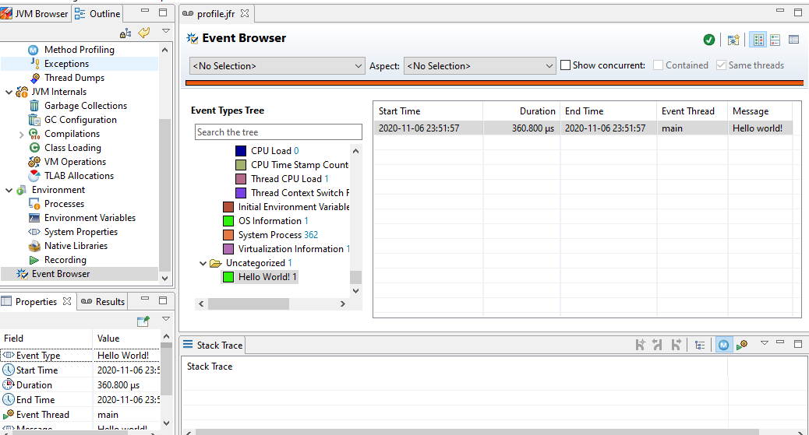
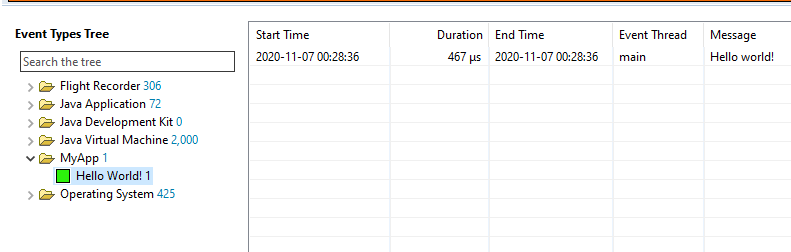
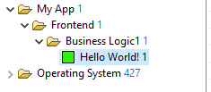

# JAX-RSにカスタムイベントを適用する

## 概要

それでは実際にカスタムイベントを使ってみましょう。

JFRをWeblogic以外で利用する場合はJVMの基本情報しかとることができないため、Webのレスポンスタイム等が取得できません。
今回は実用的な例の一つとしてJFRにJAX-RSのレスポンスタイムを書き込んでみます。本書ではサンプルとしてQuarkusを利用しますが、同じMicroProfileのHelidonはもちろん、GlassFishやPayaraなど既存のJavaEEコンテナにもそのまま適用できるはずです。

## サンプルプログラムの作成

JFRを適用するシンプルなアプリケーションを作成します。

- JAX-RSベースのシンプルなTODOアプリケーション
- JAX-RSからCDI経由でサービスモジュールを呼びその中でビジネスロジックを実行し値を返す
- 


JFRは2章で説明したようにJVM/OSの値やJava標準APIのいくつかの値はデフォルトで取得します。
しかし、実際にアプリケーションの診断を効果的にやろうとするとそれだけでは足らず、ミドルウェアや自分たちで書いているアプリケーションの値自身も取得したくなります。

それを実現するための仕組みがカスタムイベントです。JDK8までは非公式APIでしたが、JDK9から導入されたFlight Recorder APIにより現在は公式なAPIとして利用可能です。

カスタムイベントに関しては以下のドキュメントにまとまっています。
[Flight Recorder APIプログラマーズ・ガイド: 第II部 イベントの作成](https://docs.oracle.com/javase/jp/14/jfapi/create-events.html)

これによりWebのレスポンスやSQLの情報を記録したり、自作の共通ライブラリなどをフックして情報を詳細に取得することが可能になります。

## 簡単なイベントを作成してみる

とりあえずは書いてみるのが一番なので、まず簡単なイベントを作成してみましょう。
カスタムイベントは`jdk.jfr.Event`を継承する事で簡単に作成できます。

```java
import jdk.jfr.Event;
import jdk.jfr.Label;
import jdk.jfr.Name;

@Name("dev.nklab.myapp.Hello")
@Label("Hello World!")
public class Hello extends Event {

    @Label("Message")
    public String msg;
}
```

使う時は以下のようにイベントを初期化して`begin`と`commit`で計測したい間の処理を挟みます。

```java
public class Main {
    public static void main(String[] arg) {
        var event = new HelloEvent();
        event.begin();
        System.out.println("Hello JFR");
        event.msg = "Hello world!";
        event.commit();
    }
}
```

では実行してみましょう。JFRを出力したいので`-XX:StartFlightRecording:`をつけます。ちなみにつけずに実行しても問題なく動作しますがJFRは生成されません。

```bash
$ java -XX:StartFlightRecording:filename=profile.jfr -cp . chapter06.Main
Started recording 1. No limit specified, using maxsize=250MB as default.

Use jcmd 8416 JFR.dump name=1 to copy recording data to file.
Hello JFR
```

`profile.jfr`という形でJFRファイルがダンプされているのでjfrコマンドで中身を確認してみます。すべてのイベントを出力すると量が多いのでHelloイベントでフィルタリングしています。

```bash
$ jfr print --events Hello profile.jfr
dev.nklab.myapp.Hello {
  startTime = 00:07:01.010
  duration = 0.414 ms
  msg = "Hello world!"
  eventThread = "main" (javaThreadId = 1)
  stackTrace = [
    chapter06.Main.main(String[]) line: 19
  ]
}
```

`startTime`と`duration`が自動で登録されました。これは`begin`と`commit`の部分を計測しています。`msg`は`Hello`イベントに定義したフィールドです。こちらをJFRのプロパティとして任意の値を格納することが出来ます。

また、ここで表示されているイベントタイプは実際のクラスの完全修飾クラス名ではなく`@Name`で指定した値で上書きされます。 JFRの「[イベントのネーミングおよびラベル付けのガイドライン](https://docs.oracle.com/javase/jp/14/jfapi/guidelines-naming-and-labeling-events.html)」では、`@Name`を本番では省略するべきではないとしています。

それはイベント名では**意味が重複するので「event」「Event」のような名前を付けない**という事が推奨されているのですが、パッケージ名や実際のクラス名には分類のためにそれが登場する可能性が高いためです。リファクタリング等でパッケージ名等が変わっても継続して既存の名前でJFR側では解析できるという点も重要です。


続いて同じJFRファイルをJCMで開いてみましょう。



EventBrowserから同じく`Hello`イベントが確認できます。

イベントタイプが`dev.nklab.myapp.Hello`ではなく`Hello World!`であること、カラム名が`msg`ではなく`Message`な事に注目してください。これは`@Label`によって実際の表示を上書きしているためです。

また、今回は特に指定していないのでカテゴリが「 **Uncategorized** 」になっています。これは見栄えの点でも検索性の点でも良くないので`@Cateogry`を使いカテゴリを指定します。

```java
@Category("MyApp")
@Name("dev.nklab.myapp.Hello")
@Label("Hello World!")
public class HelloEvent extends Event {
    @Label("Message")
    public String msg;
}
```



`MyApp`でカテゴライズされていますね。これで任意のカテゴリに分類できます。以下のようにカテゴリを階層化する事も出来ます。


```java
@Category({"My App", "Frontend", "Business Logic1"})
@Name("dev.nklab.myapp.Hello")
@Label("Hello World!")
public class HelloEvent extends Event {
```


